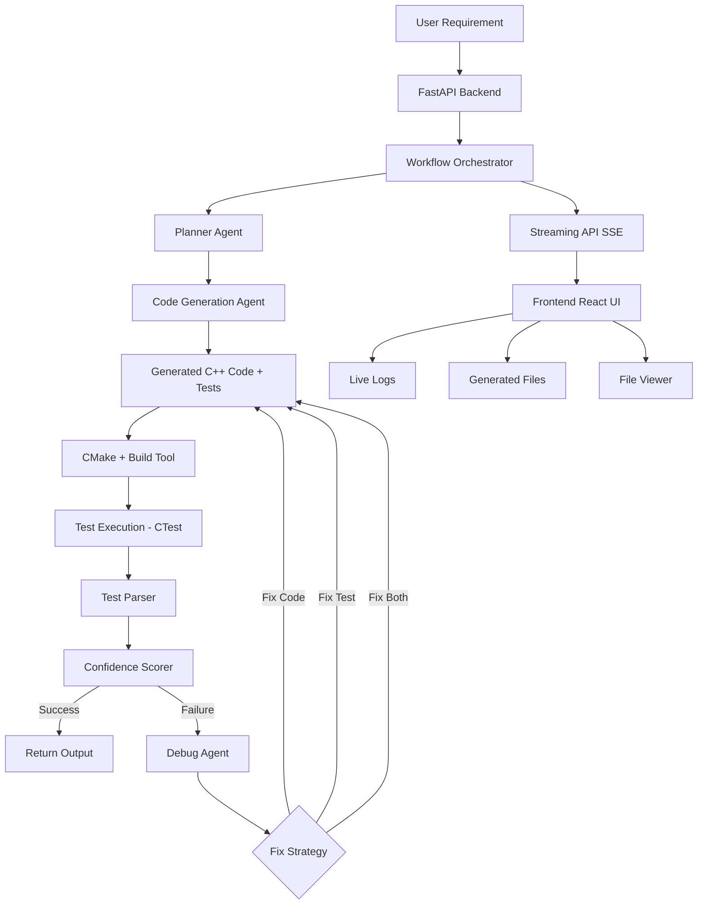

# 🚗 Agentic AI for Automotive Software Development (C/C++)

---

## 📌 Overview

This project implements a **production-grade Agentic AI system** that automates:

* Requirement → Design → Code → Test → Debug loop
* Generation of **C++ automotive software**
* Generation of **GoogleTest unit tests**
* Automatic **build + test execution**
* Self-healing via **intelligent debug agent**
* Real-time execution visibility via **streaming UI**
* Observability using **Langfuse**

---

## 🧠 Key Features

✅ Multi-agent workflow (Planner, Generator, Debugger)
✅ Automated C++ code + test generation
✅ CMake + GoogleTest integration
✅ Structured test result parsing (CTest)
✅ Confidence scoring system for validation
✅ Intelligent debug loop (fix code **and tests**)
✅ Real-time streaming execution (SSE)
✅ File viewer + download support (frontend)
✅ FastAPI interface for execution
✅ Langfuse tracing for observability

---

## 🏗️ System Architecture

```
Frontend (React)
        ↓
API (FastAPI)
        ↓
Workflow Orchestrator
        ↓
Agents (Planner → Generator → Debugger)
        ↓
Tools (Build/Test/Parse/Score)
        ↓
CMake + GoogleTest Execution
        ↓
Debug Loop (Iterative Fix)
```




---

### Components

#### **API Layer**

* FastAPI (`api/app.py`)
* Supports:

  * `/agent/run` → batch execution
  * `/agent/stream` → real-time execution (SSE)
  * `/files/{filename}` → fetch generated files

---

#### **Workflow**

* `development_workflow.py`
* Orchestrates full lifecycle:

  * Planning
  * Code generation
  * Build + test
  * Debug loop
  * Confidence evaluation

---

#### **Agents**

| Agent                   | Responsibility                                        |
| ----------------------- | ----------------------------------------------------- |
| `planner_agent`         | Requirement → structured plan                         |
| `code_generation_agent` | Plan → C++ code + tests                               |
| `debug_agent`           | Fix build issues, logic bugs, **and incorrect tests** |

---

#### **Tools**

| Tool                | Purpose                          |
| ------------------- | -------------------------------- |
| `file_writer`       | Writes generated files           |
| `cmake_generator`   | Generates build system           |
| `build_tool`        | Runs CMake + CTest               |
| `test_parser`       | Extracts structured test results |
| `confidence_scorer` | Evaluates correctness            |

---

#### **Frontend (NEW)**

* React (Vite)
* Features:

  * Live execution logs (streaming)
  * Generated file listing
  * File viewer (VS Code style)
  * File download support

---

#### **Build System**

* MSVC (Windows)
* CMake
* GoogleTest

---

#### **Observability**

* Langfuse tracing
* Captures:

  * Agent steps
  * LLM calls
  * Debug cycles

---

# 🔁 Algorithm & Workflow Design

## 🧠 High-Level Flow

```
User Input
   ↓
Planner Agent
   ↓
Code Generation Agent
   ↓
Build & Test
   ↓
Test Parser + Confidence Scorer
   ↓
Debug Agent (Code/Test Fix)
   ↓
Repeat until success
```

---

## ⚙️ Detailed Execution Steps

### Step 1: Requirement Input

* Natural language automotive requirement

---

### Step 2: Planning

* Convert requirement into structured plan
* Identify modules + test scenarios

---

### Step 3: Code Generation

* Generate:

  * `.h`
  * `.cpp`
  * `test_*.cpp`
* Enforce:

  * Deterministic logic
  * Complete includes
  * Automotive safety style

---

### Step 4: File + Build Setup

* Write files to disk
* Generate `CMakeLists.txt`

---

### Step 5: Build & Test

* Compile using CMake
* Execute tests using CTest

---

### Step 6: Test Parsing

```json
{
  "total": 5,
  "passed": 4,
  "failed": 1
}
```

---

### Step 7: Confidence Scoring

```json
{
  "confidence_score": 0.85,
  "status": "partial_success"
}
```

---

## 🔄 Step 8: Intelligent Debug Loop

### Loop Condition

```
WHILE (confidence != success AND retries < MAX_RETRIES)
```

---

### 🔍 Failure Classification

| Condition         | Type             |
| ----------------- | ---------------- |
| Compilation error | Build failure    |
| Test failure      | Logic/Test issue |
| No tests          | Generation issue |

---

### 🧠 Root Cause Analysis (KEY INNOVATION)

The debug agent determines:

```json
{
  "root_cause": "incorrect test expectation",
  "action": "fix_test"
}
```

---

### 🔧 Fix Strategy

| Action     | Behavior                |
| ---------- | ----------------------- |
| `fix_code` | Modify implementation   |
| `fix_test` | Correct test assertions |
| `fix_both` | Adjust both             |

---

### 🔁 Iteration

* Apply fix
* Rebuild
* Retest
* Re-evaluate confidence

---

## 🧪 Intelligent Debugging Principle

> **Do not assume code is wrong — validate tests as well**

---

## 📡 Real-Time Streaming Execution

**Endpoint:** `/agent/stream`

### Event Flow

```json
{ "step": "start" }
{ "step": "plan_created" }
{ "step": "code_generated", "files": [...] }
{ "step": "build_attempt", "attempt": 1 }
{ "step": "test_result", "parsed": {...} }
{ "step": "done" }
```

---

### Frontend Behavior

* Live logs update continuously
* Files appear immediately after generation
* Users can:

  * View files
  * Download files

---

## 📂 File Management

**Endpoint:** `/files/{filename}`

Capabilities:

* Fetch generated code
* Display in UI
* Download artifacts

---

## 🎯 Success Condition

```
confidence.status == "success"
```

---

## ❌ Failure Condition

```
MAX_RETRIES exceeded
```

---

## ▶️ Usage

### Example API Call

```bash
POST /generate
```

```json
{
  "requirement": "AEB system shall trigger braking when TTC < 0.8s"
}
```

---

## ⚙️ Setup Instructions

### 1. Clone Repo

```bash
git clone https://github.com/arramesh29/autodev-agentic-ai
cd autodev_agentic-ai
```

---

### 2. Create Virtual Environment

```bash
python -m venv venv
venv\Scripts\activate
```

---

### 3. Install Dependencies

```bash
pip install -r requirements.txt
```

---

### 4. Run API

```bash
python -m uvicorn api.app:app --reload
```

Open:

👉 http://127.0.0.1:8000/docs

---

## 🧪 Testing

* Framework: GoogleTest
* Coverage goals:

  * C0 (statement coverage)
  * C1 (branch coverage)

---

## 📊 Confidence System

Ensures:

* No false positives
* Reliable validation

Uses:

* Test pass ratio
* Failure detection
* Execution validation

---

## ⚠️ Known Issues

* Python 3.14 compatibility warnings (Langchain/Pydantic)
* Uvicorn reload conflicts with build artifacts
* Windows-specific CMake/MSVC setup complexities

---

## 🚀 Future Improvements

* Coverage-based scoring (gcov/lcov)
* Static analysis (MISRA, clang-tidy)
* Multi-file architecture generation
* CI/CD integration
* Build system as microservice
* Test validation agent
* Diff viewer for debug iterations

---

## 📁 Project Structure

```
autodev_agentic-ai/
│
├── api/
├── agents/
├── workflows/
├── tools/
├── generated/
├── docs/
└── README.md
```

---

## 🧠 Key Insight

> **Autonomous Software Engineering Loop**
> Generate → Validate → Fix → Repeat

---

## 📜 License

MIT License (or your choice)
