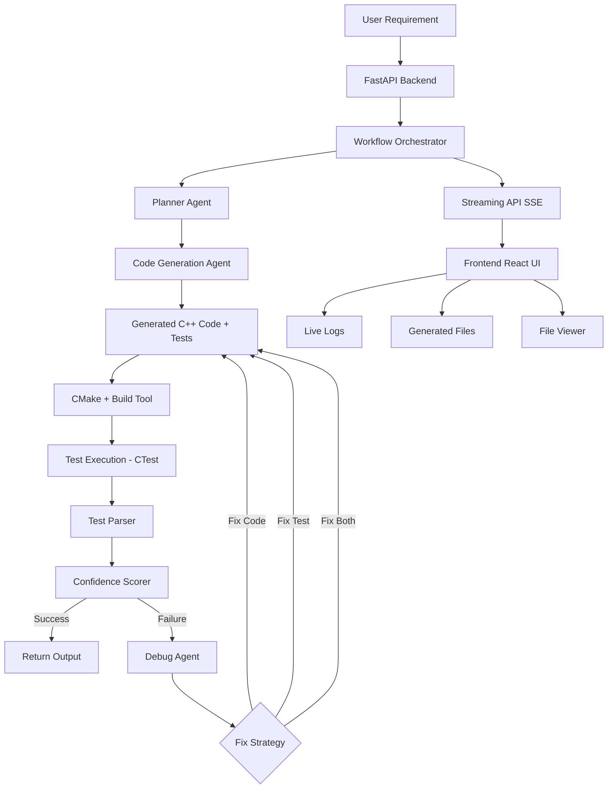

# 🚗 Agentic AI for Automotive Software Development (C/C++)

## 📌 Overview

This project implements a **production-grade Agentic AI system** that automates:

* Requirement → Design → Code → Test → Debug loop
* Generation of **C++ automotive software**
* Generation of **GoogleTest unit tests**
* Automatic **build + test execution**
* Self-healing via **debug agent**
* Observability using **Langfuse**

---

## 🧠 Key Features

✅ Multi-agent workflow (Planner, Generator, Debugger)
✅ Automated C++ code + test generation
✅ CMake + GoogleTest integration
✅ Structured test result parsing (CTest)
✅ Confidence scoring system for validation
✅ Auto-debug loop with retries
✅ FastAPI interface for execution
✅ Langfuse tracing for observability

---

## 🏗️ Architecture

```
API → Workflow → Agents → Tools → Build → Test → Debug Loop
```

## 🧭 System Architecture (Mermaid)




### Components

* **API Layer**

  * FastAPI (`api/app.py`)

* **Workflow**

  * `development_workflow.py`
  * Orchestrates full lifecycle

* **Agents**

  * `planner_agent` → Requirement → Plan
  * `code_generation_agent` → Plan → C++ code + tests
  * `debug_agent` → Fix compilation/test failures

* **Tools**

  * `file_writer` → Writes generated files
  * `cmake_generator` → Generates build system
  * `build_tool` → Runs CMake + CTest
  * `test_parser` → Extracts structured test results
  * `confidence_scorer` → Validates correctness

* **Build System**

  * MSVC (Windows)
  * CMake
  * GoogleTest

* **Observability**

  * Langfuse tracing

---

## ⚙️ Setup Instructions

### 1. Clone Repo

```bash
git clone https://github.com/arramesh29/autodev-agentic-ai
cd autodev_agentic-ai
```

---

### 2. Create Virtual Environment

```bash
python -m venv venv
venv\Scripts\activate
```

---

### 3. Install Dependencies

```bash
pip install -r requirements.txt
```

---

### 4. Run API

```bash
python -m uvicorn api.app:app --reload
```

Open:

👉 http://127.0.0.1:8000/docs

---

## ▶️ Usage

### Example API Call

```bash
POST /generate
```

```json
{
  "requirement": "AEB system shall trigger braking when TTC < 0.8s"
}
```

---

## 🔁 Workflow Execution

1. Generate development plan
2. Generate C++ code + tests
3. Build using CMake
4. Run tests (CTest)
5. Parse results
6. Compute confidence
7. If failure → Debug agent fixes → retry

---

## 📊 Confidence System

* Ensures **no false positives**
* Uses:

  * Test pass ratio
  * Failure detection
  * Execution validation

---

## 🧪 Testing

* Framework: GoogleTest
* Coverage goals:

  * C0 (statement coverage)
  * C1 (branch coverage)

---

## ⚠️ Known Issues

* Python 3.14 compatibility warnings (Langchain/Pydantic)
* Uvicorn reload conflicts with build artifacts
* Windows-specific CMake/MSVC setup complexities

---

## 🚀 Future Improvements

* Coverage-based scoring (gcov/lcov)
* Static analysis (MISRA, clang-tidy)
* Multi-file architecture generation
* Integration with CI/CD pipeline
* Separation of build service (microservice architecture)

---

## 📁 Project Structure

```
autodev_agentic-ai/
│
├── api/
├── agents/
├── workflows/
├── tools/
├── generated/
├── docs/
└── README.md
```

---

## 🧠 Key Insight

This project demonstrates:

> **Autonomous Software Engineering Loop**
> (Generate → Validate → Fix → Repeat)

---

## 📜 License

MIT License (or your choice)
